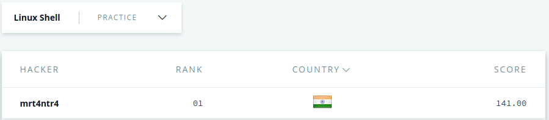

## My Solutions to HackerRank Linux Shell Practice Questions  

## My Score  

  

### [Link to Challenges](https://www.hackerrank.com/domains/shell)

## Subdomains

### $1 Bash

| Challenge     | Difficulty    | Max-Score|
| ------------- |:-------------:| ---------|
| [Let's Echo](Bash/letsEcho.sh)    | Easy |	1      |
| [Looping & Skipping](Bash/loopSkip.sh)| Easy      |	2      |
| [Personalized Echo](Bash/personalizedEcho.sh) | Easy      |	1      |
| [Looping with Numbers](Bash/loopNum.sh)| Easy| 2|
| [World of Numbers](Bash/numWorld.sh)| Easy| 2 |
| [Comparing Numbers](Bash/compNums.sh)| Easy| 3 |
| [Conditionals](Bash/conditionals.sh)| Easy| 3 |
| [More on Conditionals](Bash/triangle.sh)| Easy| 3 |
| [Arithmetic Operations](Bash/mathExpr.sh)| Medium| 3 |
| [Compute Average](Bash/avg.sh)| Medium| 4 |  

### $2 Text Processing

| Challenge     | Difficulty    | Max-Score|
| ------------- |:-------------:| ---------|
| [Cut #1](Text-Processing/cut1.sh)    | Easy |	1      |
| [Cut #2](Text-Processing/cut2.sh)    | Easy |	1      |
| [Cut #3](Text-Processing/cut3.sh)    | Easy |	1      |
| [Cut #4](Text-Processing/cut4.sh)    | Easy |	1      |
| [Cut #5](Text-Processing/cut5.sh)    | Easy |	1      |
| [Cut #6](Text-Processing/cut6.sh)    | Easy |	1      |
| [Cut #7](Text-Processing/cut7.sh)    | Easy |	1      |
| [Cut #8](Text-Processing/cut8.sh)    | Easy |	1      |
| [Cut #9](Text-Processing/cut9.sh)    | Easy |	1      |
| [Head of a Text File #1](Text-Processing/head1.sh)    | Easy |	2      |
| [Head of a Text File #2](Text-Processing/head2.sh)    | Easy |	2      |
| [Middle of a Text File](Text-Processing/middle.sh)   | Easy |	3      |
| [Tail of a Text File #1](Text-Processing/tail1.sh)   | Easy |	2      |
| [Tail of a Text File #2](Text-Processing/tail2.sh) | Easy |	2      |
| ['Tr' Command #1](Text-Processing/tr1.sh)    | Easy |	1      |
| ['Tr' Command #2](Text-Processing/tr2.sh)    | Easy |	1      |
| ['Tr' Command #3](Text-Processing/tr3.sh)    | Easy |	1      |
| ['Sort' Command #1](Text-Processing/sort1.sh)    | Easy |	1      |
| ['Sort' Command #2](Text-Processing/sort2.sh)    | Easy |	1      |
| ['Sort' Command #3](Text-Processing/sort3.sh)    | Easy |	1      |
| ['Sort' Command #4](Text-Processing/sort4.sh)    | Easy |	1      |
| ['Sort' Command #5](Text-Processing/sort5.sh)    | Easy |	1      |
| ['Sort' Command #6](Text-Processing/sort6.sh)    | Easy |	1      |
| ['Sort' Command #7](Text-Processing/sort7.sh)    | Easy |	1      |
| ['Uniq' Command #1](Text-Processing/uniq1.sh)    | Easy |	1      |
| ['Uniq' Command #2](Text-Processing/uniq2.sh)    | Easy |	1      |
| ['Uniq' Command #3](Text-Processing/uniq3.sh)    | Easy |	1      |
| ['Uniq' Command #4](Text-Processing/uniq4.sh)    | Easy |	1      |
| [Paste - 1](Text-Processing/paste1.sh)   | Medium |	2      |
| [Paste - 2](Text-Processing/paste2.sh)   | Medium |	2      |
| [Paste - 3](Text-Processing/paste3.sh)   | Medium |	2      |
| [Paste - 4](Text-Processing/paste4.sh)   | Medium |	2      |  

### $3 Grep-Sed-Awk

| Challenge     | Difficulty    | Max-Score|
| ------------- |:-------------:| ---------|
| ['Grep' #1](Grep-Sed-Awk/grep1.sh)    | Medium |	2      |
| ['Grep' #2](Grep-Sed-Awk/grep2.sh)    | Medium |	2      |
| ['Grep' #3](Grep-Sed-Awk/grep3.sh)    | Medium |	2      |
| ['Grep'-A](Grep-Sed-Awk/grepA.sh)    | Easy |	2      |
| ['Grep'-B](Grep-Sed-Awk/grepB.sh)    | Easy |	2      |
| ['Sed' command #1](Grep-Sed-Awk/sed1.sh)    | Medium |	2      |
| ['Sed' command #2](Grep-Sed-Awk/sed2.sh)    | Medium |	2      |
| ['Sed' command #3](Grep-Sed-Awk/sed3.sh)    | Easy |	2      |
| ['Sed' command #4](Grep-Sed-Awk/sed4.sh)    | Hard |	2      |
| ['Sed' command #5](Grep-Sed-Awk/sed5.sh)    | Hard |	2      |
| ['Awk' #1](Grep-Sed-Awk/awk1.sh)    | Medium |	2      |
| ['Awk' #2](Grep-Sed-Awk/awk2.sh)    | Medium |	2      |
| ['Awk' #3](Grep-Sed-Awk/awk3.sh)    | Medium |	2      |
| ['Awk' #4](Grep-Sed-Awk/awk4.sh)    | Medium |	2      |

### $4 Bash Arrays  

| Challenge     | Difficulty    | Max-Score|
| ------------- |:-------------:| ---------|
| [Read in an Array](Arrays/readArray.sh)    | Easy |	1      |
| [Slice an Array](Arrays/sliceArray.sh)    | Easy |	1      |
| [Filter an Array with Patterns](Arrays/filterArray.sh)   | Medium |	1      |
| [Concatenate an Array with itself](Arrays/concatenateArray.sh)    | Easy |	1      |
| [Display an element of an Array](Arrays/elementArray.sh)    | Easy |	1      |
| [Count number of elements in an Array](Arrays/lengthArray.sh)    | Easy |	1      |
| [Remove First Capital Letter form Each Element](Arrays/removeCapitalArray.sh)    | Medium |	1      |
| [Lonely Integer](Arrays/lonelyIntArray.sh)    | Hard |	10     |
